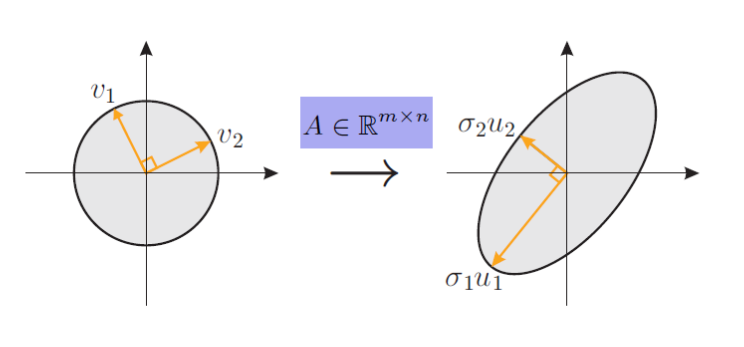
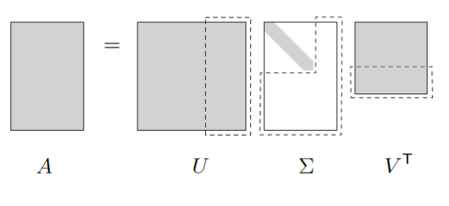

# Khai triển kỳ dị của ma trận

**Hà Nội, 2026**

---

## Ảnh của hình cầu đơn vị qua axtt (ánh xạ tuyến tính)

*(Hình minh họa: Biến đổi hình cầu đơn vị thành một ellipsoid qua ma trận $A \in \mathbb{R}^{m \times n}$. Các vector $v_1, v_2$ được ánh xạ thành $\sigma_1 u_1, \sigma_2 u_2$)*

$$S = \{ x \in \mathbb{R}^n \mid \|x\| \le 1 \}$$

$$AS = \{ Ax \mid x \in S \}$$

---

## Giá trị kỳ dị và vector kỳ dị 

*   Giả sử $A \in \mathbb{R}^{m \times n}, m > n, \text{rank}A = n$.
*   Các giá trị kỳ dị của $A$: $\sigma_1, \sigma_2, \dots, \sigma_n > 0$
*   Các vector kỳ dị trái của $A$: $u_1, u_2, \dots, u_n$ là các vector đơn vị theo các bán trục của ellipsoid $AS$.
*   Các vector kỳ dị phải của $A$: $v_1, v_2, \dots, v_n$ là các vector trực chuẩn thỏa mãn: $Av_i = \sigma_i u_i$

---

## Khai triển kỳ dị của ma trận chữ nhật đứng hạng đủ

*   **Đặt:**
    $$U = \begin{bmatrix} u_1 & u_2 & \dots & u_n \end{bmatrix}$$
    $$\Sigma = \text{diag}(\sigma_1, \sigma_2, \dots, \sigma_n)$$
    $$V = \begin{bmatrix} v_1 & v_2 & \dots & v_n \end{bmatrix}$$

*   **Khi đó:**
    $$Av_i = \sigma_i u_i \quad \forall i = \overline{1,n} \iff AV = U\Sigma \iff A = U\Sigma V^T$$
    $$\iff A = \sigma_1 u_1 v_1^T + \sigma_2 u_2 v_2^T + \dots + \sigma_n u_n v_n^T$$

---

## Trường hợp hạng không đủ

*   Trường hợp $A \in \mathbb{R}^{m \times n}, m > n, \text{rank}A = r < n$
*   Các giá trị kỳ dị: $\sigma_1 \ge \sigma_2 \ge \dots \ge \sigma_r > 0$
*   Các vector kỳ dị trái: $u_1, u_2, \dots, u_r$
*   Các vector kỳ dị phải: $v_1, v_2, \dots, v_r$
*   Khai triển kỳ dị của ma trận:
    $$U = \begin{bmatrix} u_1 & \dots & u_r \end{bmatrix} \in \mathbb{R}^{m \times r}, \quad \Sigma = \text{diag}(\sigma_1, \dots, \sigma_r) \in \mathbb{R}^{r \times r}, \quad V = \begin{bmatrix} v_1, \dots, v_r \end{bmatrix}$$
    
    $$A = U\Sigma V^T = \sigma_1 u_1 v_1^T + \sigma_2 u_2 v_2^T + \dots + \sigma_r u_r v_r^T$$

---

## Xác định giá trị kỳ dị và các vector kỳ dị 

$$A^T A = (U\Sigma V^T)^T (U\Sigma V^T) = V\Sigma^2 V^T$$

*   Do đó $v_i$ là các vector riêng ứng với các giá trị riêng khác $0$ của $A^T A$
*   $\sigma_i^2$ là các giá trị riêng của $A^T A$
*   $\{v_i\}_{i=\overline{1,r}}$ là cơ sở trực chuẩn của không gian vector $\ker A^\perp$
*   $\|A\| = \sigma_1$

---

## Xác định giá trị kỳ dị và các vector kỳ dị 

$$AA^T = (U\Sigma V^T)(U\Sigma V^T)^T = U\Sigma^2 U^T$$

*   Do đó $u_i$ là các vector riêng ứng với các giá trị riêng khác $0$ của $AA^T$
*   $\sigma_i^2$ là các giá trị riêng của $AA^T$
*   $\{u_i\}_{i=\overline{1,r}}$ là cơ sở trực chuẩn của $\text{Im}A$

---

## Nghịch đảo suy rộng 
*(Pseudo-inverse hoặc Moore-Penrose inverse)*

*   Giả sử $A$ là ma trận khác $0$ với khai triển kỳ dị là $A = U\Sigma V^T$ khi đó, $A^\dagger = V\Sigma^{-1}U^T$ được gọi là ma trận nghịch đảo suy rộng của $A$.

*   **Trường hợp $m > n$, $\text{rank}A = n$**
    $$A^\dagger = (A^T A)^{-1} A^T$$
    $$x = A^\dagger y \in X_{ls} = \left\{ z \;\Big|\; \|Az - y\| = \min_\omega \|A\omega - y\| \right\}$$

---

## Khai triển SVD đầy đủ 

*   Bổ sung cơ sở trực chuẩn của không gian con riêng ứng với giá trị riêng $0$ của ma trận $A^T A \quad (AA^T)$ tương ứng vào $V$ và $U$.

*(Hình minh họa sự phân rã của các khối ma trận: $A = U \Sigma V^T$)*

---

## Số điều kiện của ma trận 
*(Pseudo-inverse hoặc Moore-Penrose inverse)*

*   Giả sử $A$ là ma trận khả nghịch

    $$y = Ax \qquad \qquad y + \delta y = A(x + \delta x)$$

    $$\delta x = A^{-1}\delta y \implies \|\delta x\| \le \|A^{-1}\| \|\delta y\|$$

    $$\|y\| \le \|A\| \|x\| \implies \frac{1}{\|x\|} \le \frac{\|A\|}{\|y\|} \implies \frac{\|\delta x\|}{\|x\|} \le \|A\| \|A^{-1}\| \frac{\|\delta y\|}{\|y\|}$$

    $$\text{cond}A = \|A\| \|A^{-1}\| = \frac{\sigma_{\max}}{\sigma_{\min}}$$